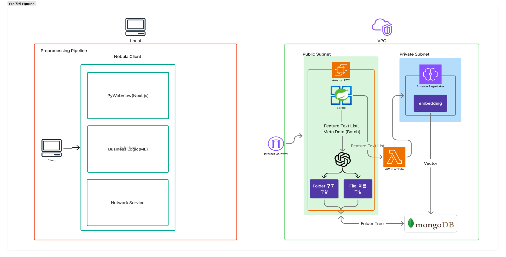

# 🌌 Nebula: AI-Powered Intelligent File Management System

> **"지능형 파일 정리를 넘어, 당신의 디지털 자산을 의미 기반으로 연결합니다."**
>
> Nebula는 AI가 파일의 내용을 스스로 이해하고, **P.A.R.A 방법론**에 따라 지능적으로 분류 및 검색해주는 데스크톱 애플리케이션의 핵심 백엔드 시스템입니다.

---

## 🏗 System Architecture

Nebula는 4개의 핵심 시스템이 유기적으로 연결된 아키텍처를 가집니다.

1. **Client (FastAPI / ML):** 로컬 파일 스캔 및 메타데이터 추출, 이미지 캡셔닝/OCR을 통한 특징 추출 담당.
2. **Back End (Spring Boot):** 배치 데이터 수신, 프롬프트 최적화 구성 및 OpenAI API 연동을 통한 데이터 구조화 수행.
3. **AI Engine:** 파일명 생성, P.A.R.A 분류 제안 및 AWS SageMaker 기반 벡터 임베딩 생성.
4. **Database (MongoDB Atlas):** 파일 메타데이터, AI 분석 결과 및 시맨틱 검색을 위한 벡터 데이터 저장.

---

## 🛠 Tech Stack

### Backend & AI

### Database

### Infrastructure & DevOps

---

## 🛠 Key Technical Features

### 1. Intelligent Feature Extraction
단순한 파일명을 넘어선 **내용 중심의 특징 추출**을 수행합니다.
* **다중 미디어 분석:** 문서, 이미지 등 7가지 미디어 포맷에서 OCR 및 ML 모델을 활용해 내부 텍스트를 추출합니다.
* **핵심 키워드 식별:** 추출된 원문 데이터에서 규칙 기반 알고리즘을 통해 연관성이 높은 5~7개의 핵심 키워드를 선별합니다.

### 2. P.A.R.A Method Organization
생산성 방법론인 P.A.R.A를 채택하여 파일을 '실행 가능성'에 따라 4가지 영역으로 자동 분류합니다.
* **Projects:** 명확한 목표와 마감일이 있는 단기 과업.
* **Areas:** 지속적인 책임이 필요한 활동 영역.
* **Resources:** 미래에 유용할 수 있는 관심 주제 및 참조 자료.
* **Archives:** 완료되었거나 더 이상 활성화되지 않은 항목.

### 3. Semantic Search (Vector Embedding)
키워드 매칭을 넘어선 **의미 기반 검색** 성능을 확보했습니다.
* **최적의 데이터 조합:** 테스트 결과 '생성된 파일명 + 키워드' 조합에서 가장 높은 검색 정확도를 확인했습니다.
* **고성능 검색:** Cosine Similarity와 HNSW 인덱스를 활용하여 **p99 응답 속도 60ms**(3,000개 문서 기준)를 달성했습니다.

---

## 🧩 Technical Challenges & Solutions

### 폴더 깊이 문제 (Folder Depth Management)
* **문제:** 폴더 구조가 지나치게 깊어질 경우 시스템 탐색 시간이 기하급수적으로 증가하고 메모리 소비가 심화되는 문제가 발생했습니다.
* **해결:** 1차 프롬프팅 후 생성된 폴더 트리를 재전송하여 구조를 최적화하고 중복 폴더를 제거하는 **2단계 폴더 재취합 로직**을 구현하여 효율성을 극대화했습니다.
